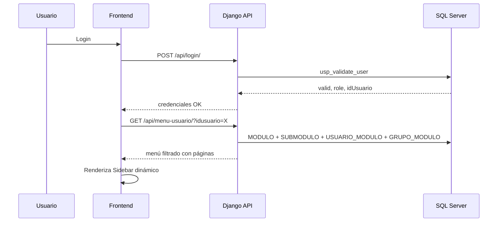
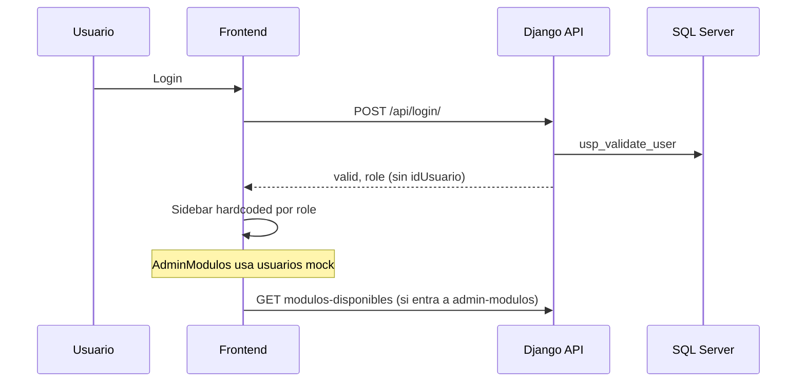

# Academia 3.0 — Contexto del proyecto

Documento maestro para que una IA (o un desarrollador nuevo) entienda **qué existe hoy**, **cómo está armado** y **qué falta por hacer**. Actualizar este archivo cuando cambie el alcance del proyecto.

---

## 1. Resumen ejecutivo

**Academia 3.0** es la reescritura moderna del sistema de gestión de **Academia VITA** (academia de preparación / instituto). Reemplaza una versión anterior (Academia 2.0) con:

- **Frontend:** React 19 + Vite 8
- **Backend:** Django 5 + Django REST Framework
- **Base de datos:** SQL Server (esquema definido por scripts SQL, no por migraciones Django)
- **Patrón de referencia:** El proyecto hermano `D:\Startup\Restaurante` ya implementó el mismo patrón (menú dinámico desde BD, módulos, permisos). Academia debe replicar ese enfoque adaptado a SQL Server.

### Objetivo principal en curso

Sistema de **módulos dinámicos**: los ítems del sidebar y los permisos de acceso viven en tablas SQL (`MODULO`, `SUBMODULO`, `USUARIO_MODULO`, `GRUPO_MODULO`), con una pantalla de administración para asignar módulos a usuarios.

### Decisión de arquitectura (confirmada)

**Mantener Django** — no reescribir el backend. Razones:

- Ya configurado para SQL Server (`mssql-django` + `pyodbc`)
- Modelos con `managed = False` respetan el enfoque DB-first
- Mismo stack que Restaurante (menos curva de aprendizaje)
- Mezcla ORM + stored procedures ya funciona (`usp_validate_user`)

---

## 2. Estructura del repositorio

```
Academia3.0/
├── README.md                    ← Este archivo (contexto maestro)
├── IMPLEMENTACION_MODULOS.md    ← Doc detallada del sistema de módulos (parcialmente desactualizada)
├── CHECKLIST_IMPLEMENTACION.txt ← Checklist paso a paso para implementar módulos
├── COMIENZA_AQUI.txt            ← Guía de inicio rápido
├── GUIA_RAPIDA.txt
├── INDICE_ARCHIVOS.txt
├── RESUMEN_CAMBIOS.txt
│
├── Backend/
│   ├── backend_project/         ← settings, urls, wsgi
│   ├── api/                     ← models, views, services, serializers, urls
│   ├── db_scripts/              ← Scripts SQL Server (fuente de verdad del esquema)
│   ├── requirements.txt
│   ├── .env.example
│   └── manage.py
│
└── Frontend/
    ├── src/
    │   ├── App.jsx              ← Router por estado (no react-router)
    │   ├── App.css              ← Estilos globales + sidebar + layout
    │   ├── index.css            ← Reset mínimo + font-size base
    │   ├── components/
    │   │   ├── admin/           ← AdminModulos (asignación drag-and-drop)
    │   │   ├── layout/          ← Layout shell
    │   │   ├── navbar/          ← Navbar superior
    │   │   ├── sidebar/         ← Sidebar (menú HARDCODEADO por rol)
    │   │   ├── header/          ← Header alternativo (no usado en Layout actual)
    │   │   └── footer/
    │   └── main.jsx
    ├── vite.config.js           ← Proxy /api → Django :8000
    └── package.json
```

---

## 3. Stack tecnológico

| Capa | Tecnología | Versión / notas |
|------|------------|-----------------|
| Frontend | React | 19.x |
| Build | Vite | 8.x, React Compiler habilitado |
| Iconos | Font Awesome | `@fortawesome/react-fontawesome` |
| Backend | Django | 5.x |
| API | djangorestframework | ViewSets + endpoints custom |
| Docs API | drf-spectacular | Swagger en `/api/docs/` |
| CORS | django-cors-headers | `CORS_ALLOW_ALL_ORIGINS = True` |
| BD | SQL Server | vía `mssql-django` + `pyodbc` |
| Config | python-dotenv | `.env` en `Backend/` |

**No hay:** react-router, Redux, TypeScript, tests automatizados, CI/CD configurado.

---

## 4. Cómo ejecutar localmente

### Backend

```powershell
cd Backend
python -m venv venv
.\venv\Scripts\Activate.ps1
pip install -r requirements.txt
copy .env.example .env
# Editar .env con credenciales SQL Server
python manage.py runserver
```

Servidor: `http://127.0.0.1:8000`

### Frontend

```powershell
cd Frontend
npm install
npm run dev
```

Vite proxyea `/api/*` hacia Django (`vite.config.js`).

### SQL Server — orden de scripts

Ejecutar en SSMS en este orden (ajustar según estado de la BD):

| Orden | Archivo | Qué hace |
|-------|---------|----------|
| 1 | `db_scripts/05_05_2026/tables.sql` | Crea `TIPOUSUARIO`, `USUARIO` (nombres originales en camelCase) |
| 2 | `db_scripts/05_05_2026/data.sql` | Datos de prueba de usuarios |
| 3 | `db_scripts/05_05_2026/Sps.sql` | `usp_validate_user` (versión camelCase) |
| 4 | `db_scripts/07_05_2026/script.sql` | Renombra columnas a MAYÚSCULAS (`IDUSUARIO`, `IDTIPOUSUARIO`, etc.) |
| 5 | `db_scripts/07_05_2026/SPs.sql` | Actualiza `usp_validate_user` a columnas en MAYÚSCULAS |
| 6 | `db_scripts/modulos_structure.sql` | Crea tablas `MODULO`, `SUBMODULO`, `TIPO_PERMISO`, `USUARIO_MODULO`, `GRUPO_MODULO` |
| 7 | `db_scripts/modulos_data_initial.sql` | Datos iniciales de módulos y permisos por rol |
| 8 | `db_scripts/modulos_verify.sql` | Verificación de instalación |

**Importante:** `modulos_structure.sql` hace `DROP TABLE` si existen las tablas de módulos. Requiere que `USUARIO` y `TIPOUSUARIO` ya existan con FKs compatibles (`IDUSUARIO`, `IDTIPOUSUARIO`).

---

## 5. Base de datos

### 5.1 Tablas core (usuarios)

Definidas en `05_05_2026/tables.sql`, renombradas en `07_05_2026/script.sql`:

| Tabla | PK | Campos relevantes |
|-------|-----|-------------------|
| `TIPOUSUARIO` | `IDTIPOUSUARIO` | `DESCRIPCION` |
| `USUARIO` | `IDUSUARIO` | `CONTRA`, `NOMBRE`, `APELLIDO`, `ESTADO`, `IDTIPOUSUARIO` (FK) |

### 5.2 Mapeo de roles

El SP `usp_validate_user` traduce `IDTIPOUSUARIO` → rol string para el frontend:

| IDTIPOUSUARIO | Rol API / frontend |
|---------------|-------------------|
| `1` | `usuario` |
| `2` | `secretario` |
| `3` | `admin` |

Login valida: `IDUSUARIO = @username`, `CONTRA = @password`, `ESTADO = 'Activo'`.

### 5.3 Tablas de módulos

Definidas en `modulos_structure.sql`:

| Tabla | Propósito |
|-------|-----------|
| `MODULO` | Módulos del menú (Dashboard, Usuarios, etc.) |
| `SUBMODULO` | Hijos de cada módulo (ej. "Registrar usuario") |
| `TIPO_PERMISO` | Catálogo: read, write, delete, admin |
| `USUARIO_MODULO` | Módulos asignados a un usuario concreto |
| `GRUPO_MODULO` | Módulos asignados por rol (`IDGRUPO` = `IDTIPOUSUARIO`) |

**Convenciones de IDs:**

- Módulos: `MOD001`, `MOD002`, …
- Submódulos: `SUB001`, `SUB002`, …
- Permisos: `PER001`–`PER004`
- Asignación usuario: `USR_MOD_<uuid>`
- Asignación grupo: `GRM001`, …

**Campo `PERMISOS`:** JSON en `NVARCHAR(MAX)`, ej. `["read","write","delete","admin"]`.

**Campo `ICONO`:** Nombre de ícono FontAwesome sin prefijo `fa`, ej. `faGauge` → en frontend se usa con `@fortawesome/free-solid-svg-icons`.

### 5.4 Módulos iniciales (datos seed)

| ID | Nombre | Orden |
|----|--------|-------|
| MOD001 | Dashboard | 1 |
| MOD002 | Usuarios | 2 |
| MOD003 | Asistencias | 3 |
| MOD004 | Membresías | 4 |
| MOD005 | Biblioteca | 5 |
| MOD006 | Exámenes | 6 |
| MOD007 | Notas | 7 |
| MOD008 | Administración de Módulos | 99 |

### 5.5 Modelo Django ↔ SQL Server

Todos los modelos de negocio usan **`managed = False`** — Django **no crea ni altera** esas tablas.

Archivo: `Backend/api/models.py`

| Modelo Django | Tabla SQL | Notas |
|---------------|-----------|-------|
| `Cliente` | `clientes` | Ejemplo/demo ORM, posiblemente no existe en BD real |
| `TipoPermiso` | `TIPO_PERMISO` | |
| `Modulo` | `MODULO` | PK `IDMODULO` |
| `Submodulo` | `SUBMODULO` | FK `IDMODULO` |
| `UsuarioModulo` | `USUARIO_MODULO` | `IDUSUARIO` es CharField, no FK Django |
| `GrupoModulo` | `GRUPO_MODULO` | `IDGRUPO` referencia `IDTIPOUSUARIO` |

Fechas en BD son `NVARCHAR(20)` con formato `YYYYMMDD HH:MM:SS`, no `DateTimeField` Django.

---

## 6. Backend — API

Base URL: `/api/`

Documentación interactiva: `/api/docs/` (Swagger), `/api/redoc/`

### 6.1 Endpoints implementados

| Método | Ruta | Estado | Descripción |
|--------|------|--------|-------------|
| GET | `/api/status/` | ✅ | Health check JSON |
| GET | `/api/clientes/` | ✅ Demo | ORM sobre tabla `clientes` |
| GET | `/api/clientes-sp/` | ⚠️ | Requiere SP `usp_get_clientes` en BD |
| POST | `/api/login/` | ✅ | Body: `{username, password}` → `{valid, role}` vía `usp_validate_user` |
| GET | `/api/modulos-disponibles/` | ✅ Parcial | Lista módulos activos con submódulos |
| GET/POST | `/api/modulos-asignados-usuario/` | ✅ Parcial | GET por `?idusuario=`, POST asignar/desasignar |
| GET | `/api/modulos/` | ⚠️ | DRF ViewSet, requiere `IsAuthenticated` (no hay auth JWT/session real) |
| GET | `/api/submodulos/` | ⚠️ | Igual |
| * | `/api/usuario-modulos/` | ⚠️ | ViewSet CRUD |
| * | `/api/grupo-modulos/` | ⚠️ | ViewSet CRUD |

### 6.2 Servicios

Archivo: `Backend/api/services.py`

```python
get_clientes()           # ORM Cliente
get_clientes_sp()        # EXEC usp_get_clientes
validate_user(u, p)      # EXEC usp_validate_user → (bool, role)
```

**No existe aún en Academia** (sí en Restaurante):

- `get_menu_for_user(idusuario)`
- `get_effective_modulos(idusuario)` — merge rol + asignaciones usuario
- `menu_config.py` — mapa `IDMODULO` → página React

### 6.3 Configuración BD

`Backend/backend_project/settings.py`:

- `DB_ENGINE=mssql` → SQL Server
- `DB_ENGINE` distinto → SQLite local (`db.sqlite3`) para desarrollo sin BD
- Variables: `DB_NAME`, `DB_USER`, `DB_PASSWORD`, `DB_HOST`, `DB_PORT`, `DB_DRIVER`, `DB_TRUSTED_CONNECTION`

### 6.4 Autenticación — estado actual

- Login valida contra SQL Server pero **no hay sesión Django ni JWT**.
- Endpoints DRF usan `permission_classes = [IsAuthenticated]` pero el frontend **no envía tokens**.
- El frontend guarda en `localStorage`: `isAuthenticated`, `role`, `activePage`.
- **El rol no se valida en backend** en los endpoints de módulos; es solo estado del cliente.

---

## 7. Frontend

### 7.1 Navegación

**No usa react-router.** La página activa es estado React:

- `activePage` — string: `dashboard`, `usuarios`, `admin-modulos`, etc.
- `pageContent` en `App.jsx` mapea página → título/descripción/componente
- Solo `admin-modulos` tiene componente real (`AdminModulos`); el resto muestra placeholder

### 7.2 Layout

```
┌─────────────┬──────────────────────────────────┐
│   Sidebar   │  Navbar (ACADEMIA VITA + usuario) │
│   (220px)   ├──────────────────────────────────┤
│             │  Content (página activa)          │
│             ├──────────────────────────────────┤
│             │  Footer                           │
└─────────────┴──────────────────────────────────┘
```

Componentes:

- `Layout.jsx` — ensambla Sidebar + Navbar + children + Footer
- `Sidebar.jsx` — menú **hardcodeado** en `sidebarConfig` por rol (`admin`, `secretario`, `usuario`)
- `Navbar.jsx` — hamburger, marca, notificaciones (vacías), rol, menú usuario
- `Header.jsx` — existe pero **no se usa** en Layout actual

### 7.3 Sidebar — configuración actual (hardcoded)

Archivo: `Frontend/src/components/sidebar/Sidebar.jsx`

El menú **no lee la BD**. Está duplicado por rol en `sidebarConfig`. Incluye secciones colapsables (`SidebarSection`, `SidebarSubLink`).

Páginas referenciadas: `dashboard`, `usuarios`, `asistencias`, `membresias`, `pagos`, `biblioteca`, `examenes`, `notas`, `horario`, `admin-modulos`.

Comportamiento responsive:

- `< 900px` → sidebar móvil overlay
- `< 1100px` → sidebar colapsado automático
- Ancho: 220px (colapsado: 60px)

### 7.4 AdminModulos — pantalla de asignación

Archivo: `Frontend/src/components/admin/AdminModulos.jsx`

UI de dos paneles con drag-and-drop:

- Izquierda: módulos disponibles
- Derecha: módulos asignados al usuario seleccionado

**Limitaciones actuales:**

| Aspecto | Estado |
|---------|--------|
| Lista de usuarios | **Mock hardcoded** (Juan, María, Carlos) — no llama API real |
| Carga módulos | Llama `/api/modulos-disponibles/` y `/api/modulos-asignados-usuario/` |
| Asignar/desasignar | POST a `/api/modulos-asignados-usuario/` |
| CRUD de módulos (alta/edición) | **No implementado** — solo asignación |
| Permisos granulares en UI | Muestra badges pero asigna `["read","write"]` fijo |

### 7.5 Login

- Formulario en `App.jsx` cuando `isAuthenticated === false`
- POST `/api/login/` con username/password
- Sin recordar `idUsuario` en localStorage (solo rol) — **pendiente** para menú dinámico por usuario

### 7.6 Estilos y UI (última revisión)

- Fuente base: **15px** (`index.css` + `App.css`)
- `color-scheme: light` forzado (evita selects con texto blanco en modo oscuro del SO)
- Sidebar compacto, sin mensajes de debug ("Django backend conectado", "Actualización a Academia 3.0")
- Marca: **ACADEMIA VITA**
- Colores primarios: púrpura `#3d348b` / `#4b3d90`

---

## 8. Flujo objetivo vs flujo actual

### Objetivo (como Restaurante)



### Actual



---

## 9. Qué está hecho vs qué falta

### ✅ Hecho

- [x] Proyecto Django + React configurado
- [x] Conexión SQL Server en settings
- [x] Scripts SQL de tablas base, migración a MAYÚSCULAS, módulos, datos seed, verificación
- [x] Modelos Django `managed=False` para módulos
- [x] Serializers DRF
- [x] Login vía stored procedure
- [x] Endpoints básicos de módulos (disponibles, asignados)
- [x] UI shell: login, layout, sidebar, navbar, footer
- [x] Pantalla AdminModulos (asignación UI, parcialmente conectada)
- [x] Proxy Vite → Django
- [x] Documentación auxiliar (IMPLEMENTACION_MODULOS.md, checklists)

### ❌ Pendiente (prioridad sugerida)

1. **Conectar SQL Server en `.env` real** y ejecutar scripts en BD de desarrollo
2. **Endpoint `GET /api/menu-usuario/`** — portar lógica de `Restaurante/Backend/api/services.py`
3. **`menu_config.py`** — mapa `MOD001` → `dashboard`, `SUB003` → página, íconos FA
4. **Sidebar dinámico** — reemplazar `sidebarConfig` hardcoded por fetch al menú del usuario logueado
5. **Guardar `idUsuario` en login** — localStorage/session para identificar usuario en API
6. **API listar usuarios reales** — reemplazar mock en AdminModulos
7. **Autenticación real en API** — sesión, JWT o al menos quitar `IsAuthenticated` en dev / usar `@csrf_exempt` consistente
8. **CRUD mantenimiento de módulos** — alta/edición/desactivación de `MODULO` y `SUBMODULO`
9. **Módulos funcionales** — Usuarios, Asistencias, Membresías, etc. (solo placeholders hoy)
10. **Alinear `usp_validate_user`** en SP antiguo (`idUsuario`) vs nuevo (`IDUSUARIO`) según scripts ejecutados
11. **Tabla `clientes` / `usp_get_clientes`** — demo legacy, limpiar o documentar si no aplica

---

## 10. Referencia: proyecto Restaurante

Ruta: `D:\Startup\Restaurante`

Archivos clave a portar/adaptar:

| Archivo Restaurante | Qué hace | Estado en Academia |
|---------------------|----------|-------------------|
| `api/menu_config.py` | `MODULO_PAGE_MAP`, `SUBMODULO_PAGE_MAP`, dashboard por rol | ❌ No existe |
| `api/services.py` | `get_menu_for_user`, `get_effective_modulos`, asignaciones | ❌ Parcial |
| `api/views.py` | `menu_usuario`, modulos admin completos | ❌ Parcial |
| `Frontend Sidebar` | Consume menú API | ❌ Hardcoded |

Restaurante usa **MySQL**; Academia usa **SQL Server** — la lógica es la misma, cambian detalles de SQL/tipos.

---

## 11. Endpoints — detalle de contratos

### POST `/api/login/`

```json
// Request
{ "username": "admin01", "password": "****" }

// Response 200
{ "valid": true, "role": "admin" }

// Response 200 (fallo credenciales)
{ "valid": false, "role": "usuario" }
```

### GET `/api/modulos-disponibles/`

```json
{
  "success": true,
  "modulos": [
    {
      "IDMODULO": "MOD001",
      "NOMBRE": "Dashboard",
      "DESCRIPCION": "...",
      "ICONO": "faGauge",
      "ORDEN": 1,
      "submodulos": [
        { "IDSUBMODULO": "SUB001", "NOMBRE": "Estadísticas", "ICONO": "faChartBar", "ORDEN": 1 }
      ]
    }
  ]
}
```

### GET `/api/modulos-asignados-usuario/?idusuario=user1`

```json
{
  "success": true,
  "asignados": [
    {
      "IDUSUARIO_MODULO": "USR_MOD_ABC123",
      "IDMODULO_id": "MOD002",
      "IDMODULO__NOMBRE": "Usuarios",
      "IDMODULO__ICONO": "faUsers",
      "PERMISOS": "[\"read\",\"write\"]"
    }
  ]
}
```

### POST `/api/modulos-asignados-usuario/`

```json
// Asignar
{
  "idusuario": "user1",
  "idmodulo": "MOD003",
  "accion": "asignar",
  "permisos": ["read", "write"]
}

// Desasignar
{
  "idusuario": "user1",
  "idmodulo": "MOD003",
  "accion": "desasignar"
}
```

---

## 12. Problemas conocidos / inconsistencias

1. **FK en `modulos_structure.sql`:** referencia `TIPOUSUARIO(IDTIPOUSUARIO)` — requiere script `07_05_2026/script.sql` ejecutado antes.
2. **Dos versiones de `usp_validate_user`:** `05_05_2026/Sps.sql` (camelCase) vs `07_05_2026/SPs.sql` (MAYÚSCULAS). Usar la que coincida con columnas reales de la BD.
3. **ViewSets DRF con `IsAuthenticated`:** el frontend no autentica requests → endpoints del router fallan con 403.
4. **`PERMISOS` en BD es NVARCHAR** pero modelo Django usa `JSONField` — funciona en lectura/escritura vía Django pero el SP directo debe enviar JSON válido.
5. **`AdminModulos`:** race condition al cargar disponibles vs asignados (usa `modulosAsignados` del render anterior en el primer fetch).
6. **`Header.jsx`:** componente huérfano; Layout usa `Navbar.jsx`.
7. **Docs en raíz** (`IMPLEMENTACION_MODULOS.md`, etc.) pueden estar desincronizados con el código — **este README tiene prioridad** para contexto de IA.

---

## 13. Convenciones de código

### Backend (Python/Django)

- Modelos de BD legacy: campos en MAYÚSCULAS como en SQL Server
- Tablas externas: `managed = False`
- Lógica de BD compleja: stored procedures en `db_scripts/`, llamados desde `services.py` con `connection.cursor()`
- URLs de API: kebab-case (`modulos-disponibles/`)
- CSRF: endpoints custom usan `@csrf_exempt` (SPA sin token CSRF configurado)

### Frontend (React)

- Componentes en `PascalCase`, archivos `.jsx`
- Estilos globales en `App.css`; estilos de módulo en CSS junto al componente (ej. `AdminModulos.css`)
- Sin TypeScript
- Estado local con `useState` / `useEffect`; sin store global
- Font Awesome para iconos del sidebar

### SQL

- IDs de negocio como `NVARCHAR(50)` con prefijos semánticos (`MOD`, `SUB`, `GRM`, `USR_MOD_`)
- Fechas como string `NVARCHAR(20)` formato `YYYYMMDD HH:MM:SS`
- Scripts idempotentes donde sea posible; `modulos_structure.sql` hace DROP (destructivo)

---

## 14. Archivos de documentación adicionales

| Archivo | Uso |
|---------|-----|
| `IMPLEMENTACION_MODULOS.md` | Guía extensa del sistema de módulos |
| `CHECKLIST_IMPLEMENTACION.txt` | Checklist operativo para implementar módulos |
| `COMIENZA_AQUI.txt` | Punto de entrada para desarrolladores |
| `GUIA_RAPIDA.txt` | Referencia rápida |
| `Backend/db_scripts/ejemplos_uso.sql` | Queries de ejemplo para módulos y permisos |
| `Backend/README.md` | Setup backend (parcialmente desactualizado) |

---

## 15. Próximos pasos recomendados (para pedir a la IA)

Cuando continúes el desarrollo, puedes pedir cosas como:

1. *"Porta `get_menu_for_user` de Restaurante y crea `/api/menu-usuario/`"*
2. *"Conecta el Sidebar a la API de menú"*
3. *"Crea endpoint GET `/api/usuarios/` desde tabla USUARIO"*
4. *"Reemplaza usuarios mock en AdminModulos"*
5. *"Implementa CRUD de módulos (mantenimiento)"*
6. *"Implementa módulo de Usuarios (listado + registro)"*

Indica siempre si la BD ya tiene los scripts ejecutados o hay que asumir BD vacía.

---

## 16. Historial de decisiones

| Fecha | Decisión |
|-------|----------|
| 2026-05 | Inicio Academia 3.0 sobre Django + React + SQL Server |
| 2026-05-09 | Diseño sistema de módulos dinámicos (tablas + AdminModulos) |
| 2026-06 | Confirmado: mantener Django (no reescribir backend) |
| 2026-06 | UI: sidebar compacto, fuente 15px, eliminados mensajes de debug |
| 2026-06 | Patrón de referencia: `D:\Startup\Restaurante` para menú dinámico |

---

*Última actualización: 2026-06-22 — Generado para contexto de IA y continuidad del desarrollo.*
